

# scada-labview-heating-control-system

This is a LabVIEW-based SCADA heating control system utilizing the Datalogging and Supervisory Control Module. It supports automatic, manual, and maintenance modes, with robust temperature state management and logging.  

---

## 📑 Table of Contents

- [Overview](#overview)  
- [System States](#system-states)  
- [State Transitions](#state-transitions)  
- [Server Components](#server-components)  
- [Client Interface](#client-interface)  
- [Global Variables Panel](#global-variables-panel)  
- [How to Use](#how-to-use)  
- [Requirements](#requirements)  

---

## 📘 Overview

This SCADA system automates temperature control using threshold-based logic and logs real-time data. It supports three operational modes:

- **Automatic**: Temperature is maintained between predefined bounds.
- **Manual**: User directly controls the heater.
- **Maintenance**: System halts operation due to a fault (e.g., overheating).

---

## 🧭 System States

| **State**                | **Description**                                            | **On Entry**                | **On Exit**                     |
|--------------------------|------------------------------------------------------------|-----------------------------|----------------------------------|
| Idle (Standby)           | Inactive; waiting for conditions to change.                | Turn off heating element.   | Prepare for heating/cooling.    |
| Auto Heating ON          | Heater is on; raising temperature to setpoint.             | Enable heating element.     | Disable heating element.        |
| Auto Heating OFF         | Heater is off; system is cooling.                          | Disable heating element.    | Enable heating element.         |
| Manual Mode              | User overrides automated behavior.                         | Disable auto transitions.   | Re-enable automatic logic.      |
| └── Manual Heating ON    | User forces heater ON.                                     | Enable heating element.     | –                                |
| └── Manual Heating OFF   | User forces heater OFF.                                    | Disable heating element.    | –                                |
| Maintenance Mode         | Triggered on faults (e.g., temp > 100°C).                  |  Disable control.| Reset after maintenance.         |

---

## 🔁 State Transitions

### Automatic Mode

| From               | To                  | Trigger                                      |
|--------------------|---------------------|----------------------------------------------|
| Idle               | Auto Heating ON      | Temp < Setpoint (auto mode active).          |
| Auto Heating ON    | Auto Heating OFF     | Temp ≥ Setpoint.                             |
| Auto Heating OFF   | Idle                 | Temp stabilizes.                             |
| Auto Heating OFF   | Auto Heating ON      | Temp < Setpoint.                             |

### Manual Mode

| From                   | To                      | Trigger                                   |
|------------------------|-------------------------|--------------------------------------------|
| Any                    | Manual Mode             | Manual control enabled.                    |
| Manual ON              | Manual OFF              | User toggles heater OFF.                   |
| Manual OFF             | Manual ON               | User toggles heater ON.                    |
| Manual Mode            | Idle                    | Manual control disabled.                   |

### Maintenance Mode

| From         | To            | Trigger                          |
|--------------|---------------|----------------------------------|
| Any          | Maintenance   | Temperature > 100°C.             |
| Maintenance  | Idle          | Fault cleared + reset.           |

---

## 🖥️ Server Components

### Front Panel  
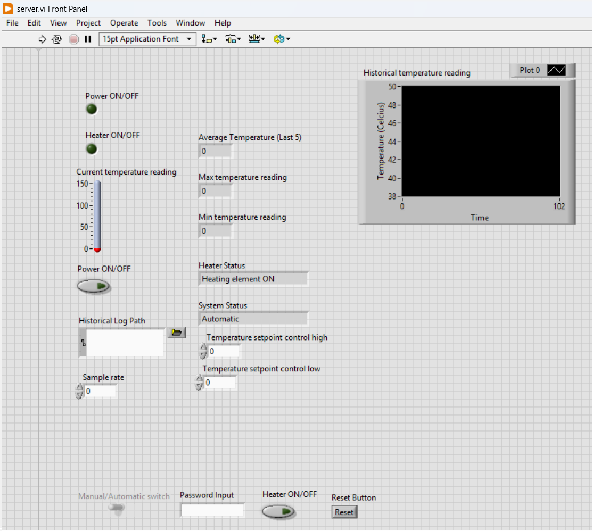

### Block Diagram Snapshots

- **Full Diagram**  
  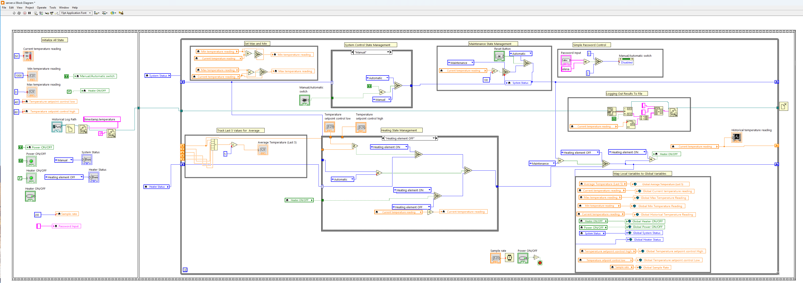

- **Initialization**  
  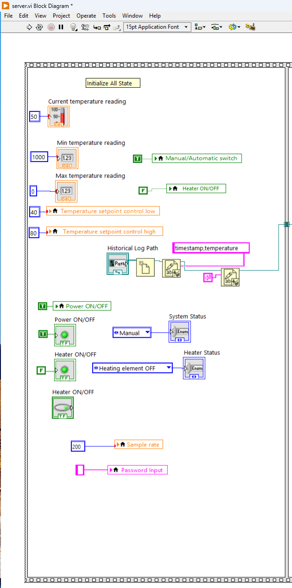

- **Temperature Tracking**  
  - Max/Min:  
    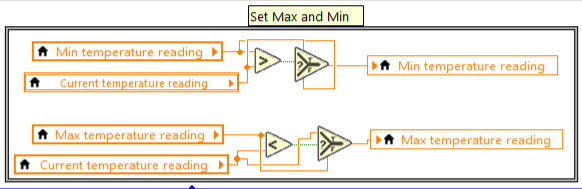  
  - Last 5 Average:  
    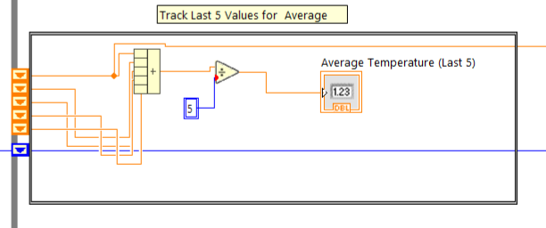

- **System Control**  
  - Automatic:  
    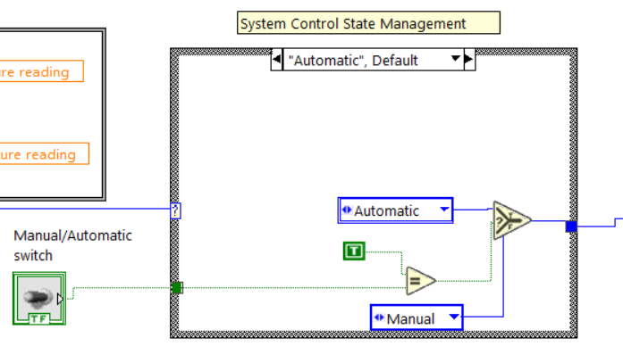  
  - Manual:  
    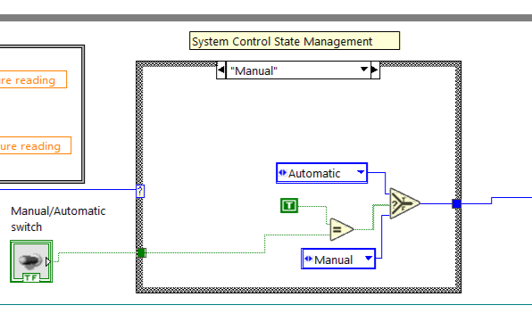  
  - Maintenance:  
    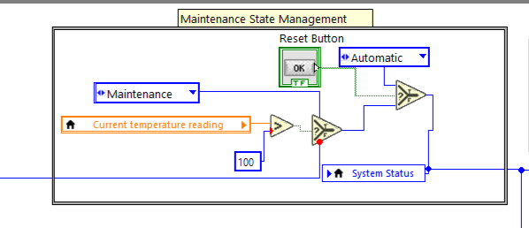

- **Other Features**  
  - Password Protection:  
    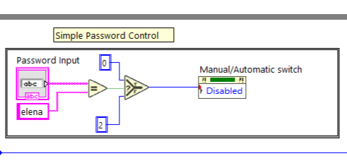  
  - Variable Mapping:  
    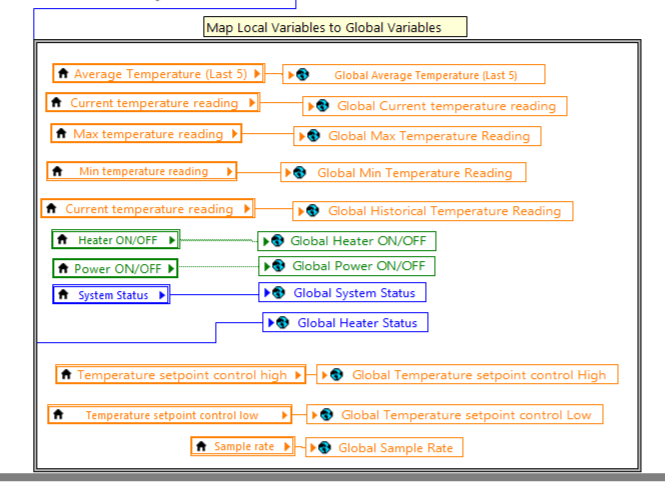  
  - Heater ON/OFF:  
    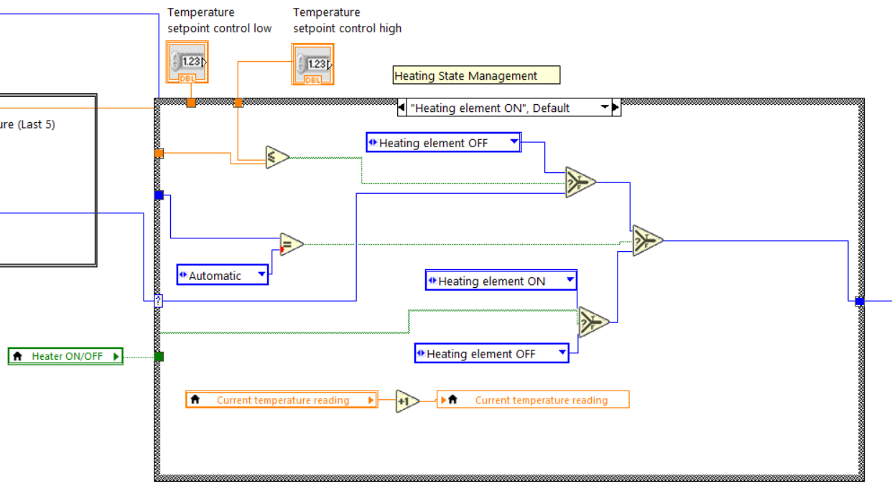  
    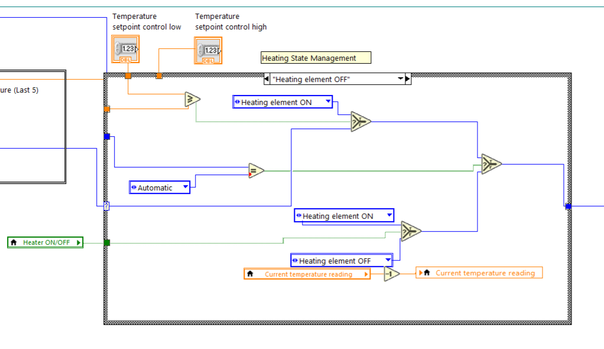

- **Data Logging**  
  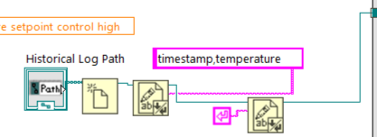  
  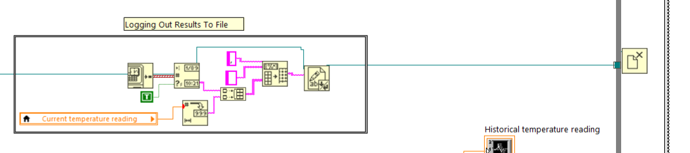  
  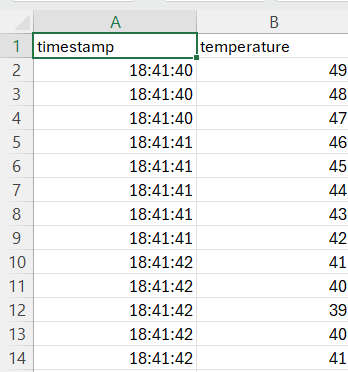

---

## 🧑‍💻 Client Interface

### Front Panel  
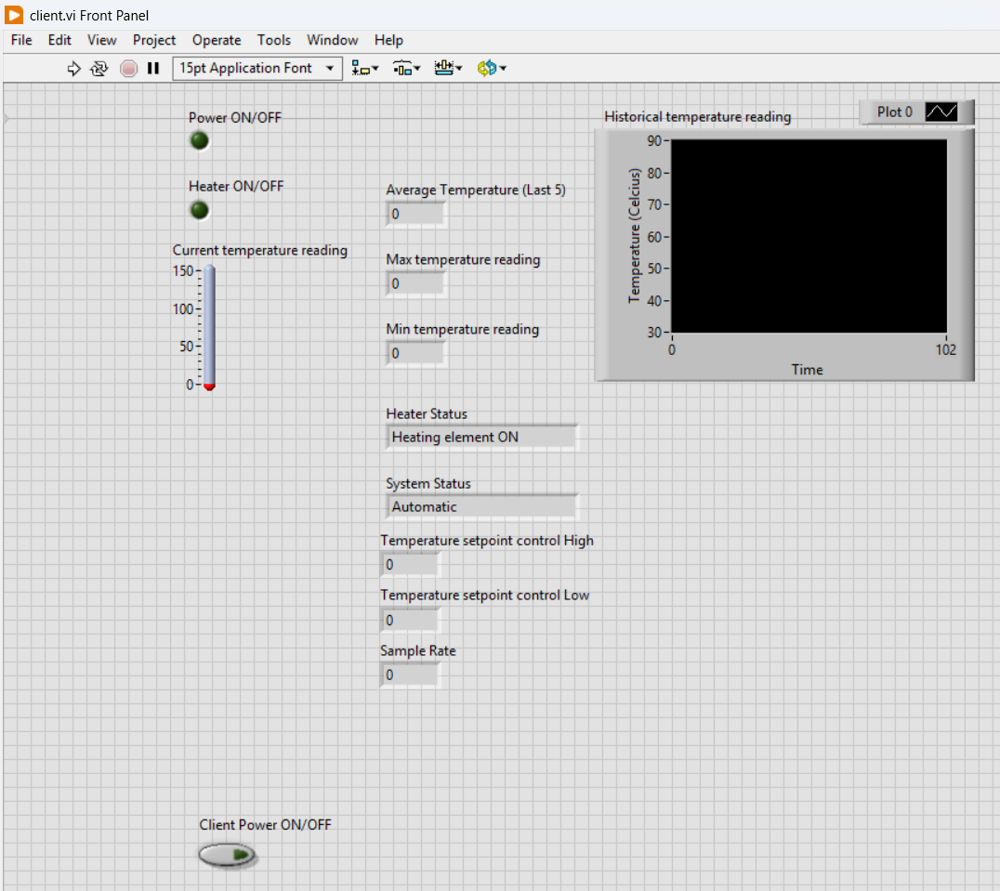

### Block Diagram  

---

## 🌐 Global Variables Panel

### Front Panel  
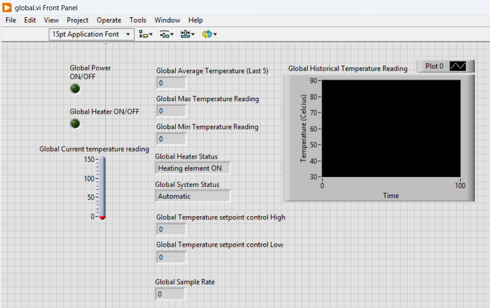

---

## ▶️ How to Use

1. **Launch Panels:**
   - Server Front + Block Diagram
   - Client Front + Block Diagram
   - Global Front Panel

2. **Set CSV Log Path:**
   - In the Server Front Panel, configure via *Historical Log Path Dialog*.

3. **Start Execution:**
   - Click the Run arrow on the Server, then on the Client.

4. **Initial System State:**

   | Variable               | Value          |
   |------------------------|----------------|
   | Temperature            | 50             |
   | Min Temperature        | 1000           |
   | Max Temperature        | 0              |
   | System Control         | Automatic      |
   | Heater                 | OFF            |
   | Temp Low Point         | 40             |
   | Temp High Point        | 80             |
   | Power                  | ON             |
   | Sample Rate            | 200            |
   | Password               | `Elena`        |
   | Password Input         | `""` (blank)   |

5. **Behavior:**
   - Heater toggles between ON/OFF based on thresholds (40–80°C) in Auto mode.
   - Manual mode can be enabled with the password `Elena`.

---

## ⚙️ Requirements

- LabVIEW (2025 Q1 or later)  
- LabVIEW Datalogging and Supervisory Control Module  
- Windows OS  

---