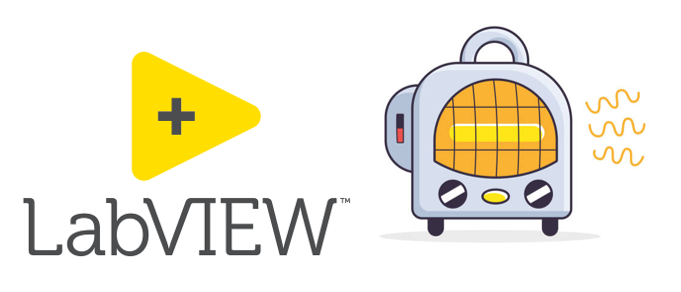
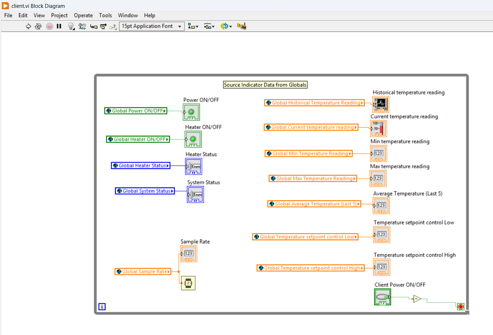



# scada-labview-heating-control-system

SCADA Heating Control System using LabVIEW Datalogging and Supervisory Control Module

## State Table

| State Name              | Description                                                                 | Entry Action                     | Exit Action                      |
|-------------------------|-----------------------------------------------------------------------------|----------------------------------|----------------------------------|
| Idle (Standby)          | System inactive, waiting for triggers.                                      | Turn off heating element.        | Prepare for heating/cool down.     |
| Automatic Heating Element On      | Actively heating to reach target temperature.                               | Enable heating element.          | Disable heating element.         |
| Automatic Heating Element Off     | Cooldown phase                                    |      Disable heating element.      |          Enable heating element.           |
| Manual Mode             | User overrides automatic control.                                           | Disable automatic transitions.   | Re-enable automatic logic.       |
| - Manual Heating On     | User forces heating element on.                                             | Enable heating element.          | –                                |
| - Manual Heating Off    | User forces heating element off.                                            | Disable heating element.         | –                                |
| Maintenance Mode         | Activated on critical faults (e.g., temperature over 100°C).                        | Temperature > 100°C     | Reset faults after maintenance.  |

## State Transition tables

#### Automatic Mode Transitions
| From State          | To State              | Trigger/Condition                                                                 |
|---------------------|-----------------------|-----------------------------------------------------------------------------------|
| Idle                | Heating Element On    | Temperature < Setpoint (auto mode enabled).                                       |
| Heating Element On  | Heating Element Off   | Temperature ≥ Setpoint                                 |
| Heating Element Off | Idle                  | Temperature stabilizes                                |
| Heating Element Off | Heating Element On    | Temperature < Setpoint                         |

#### Manual Mode Transitions
| From State              | To State              | Trigger/Condition                                                                 |
|-------------------------|-----------------------|-----------------------------------------------------------------------------------|
| Any state              | Manual Mode           | Manual control switch enabled.                                                   |
| Manual Mode (Heating On)| Manual Mode (Off)     | User toggles manual switch to "Off".                                              |
| Manual Mode (Heating Off)| Manual Mode (On)     | User toggles manual switch to "On".                                               |
| Manual Mode            | Idle                  | Manual control switch disabled.                                                   |

#### Maintenance Mode Transitions
| From State              | To State              | Trigger/Condition                                                                 |
|-------------------------|-----------------------|-----------------------------------------------------------------------------------|
| Any state              | Maintenance Mode       | Critical fault detected (e.g. temperature over 100°C).                                   |
| Maintenance Mode        | Idle                  | Maintenance complete + system reset.                                              |

## Block Diagrams

### Server

#### Full Diagram:  
#### Idle State:  

#### Heating Element On State:  

#### Heating Element Off State:  

### Client

## Front Panel

#### Controls and indicators: 

